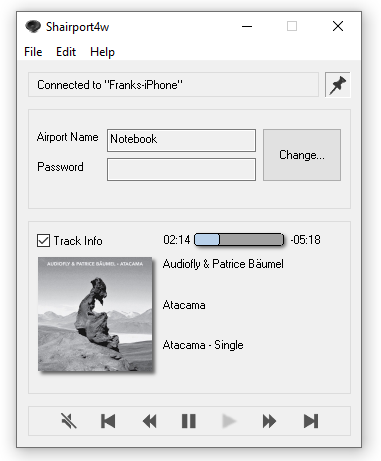
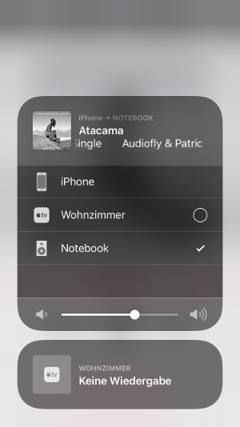

# Shairport4w

> **News:** Shairport4w is outdated and now has a successor: [ShairportQt](https://github.com/Frank-Friemel/ShairportQt)
which is cross platform and brings many bug fixes.

An AirPlay Audio-Receiver for your Windows-PC

Play audio content from your iPhone, iPad, iPod or iTunes on your PC with Shairport4w.
AirPlay lets you wirelessly stream what's on your iOS device whenever you see the AirPlay symbol

Download pre compiled binaries from [`Releases`](https://github.com/Frank-Friemel/Shairport4w/releases)
When being asked by your Firewall you should grant access to your LAN if secure. Protect Shairport4w with a password
to be sure nobody is misusing this service

### Third party libraries
* [`WTL`](https://sourceforge.net/projects/wtl) Windows Template Library

### Thanks
* Thanks to James Laird who implemented the original version of "Shairport". Special thanks to Japanese Translator [maborosohin](https://github.com/maboroshin).

### License
GPL. Sources that deviate from this license are marked by a header

### Screen

